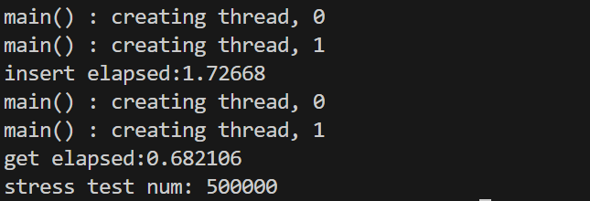

# KVStorageEngine

## 简介
本项目使用C++实现了跳表这一数据结构，并将其作为数据库的存储引擎，它支持对键值数据高效的添加、删除、修改和查询操作。另外通过定期的落盘存储，避免数据丢失。

## 项目文件说明
```
./include/node.hpp 键值对数据底层类设计
./include/skiplist.hpp 基于跳表的存储引擎实现类, 对node对象进行相关操作
./store/dumpfile 数据落盘文件
./test/stress.cpp 压力测试代码文件
```

## 压力测试
```
cd kvstorageEngine
mkdir build
cd build
cmake ..
make
cd ../bin
./Test
```



```
插入数据QPS: 29.4W
查询数据QPS: 73.5W
```